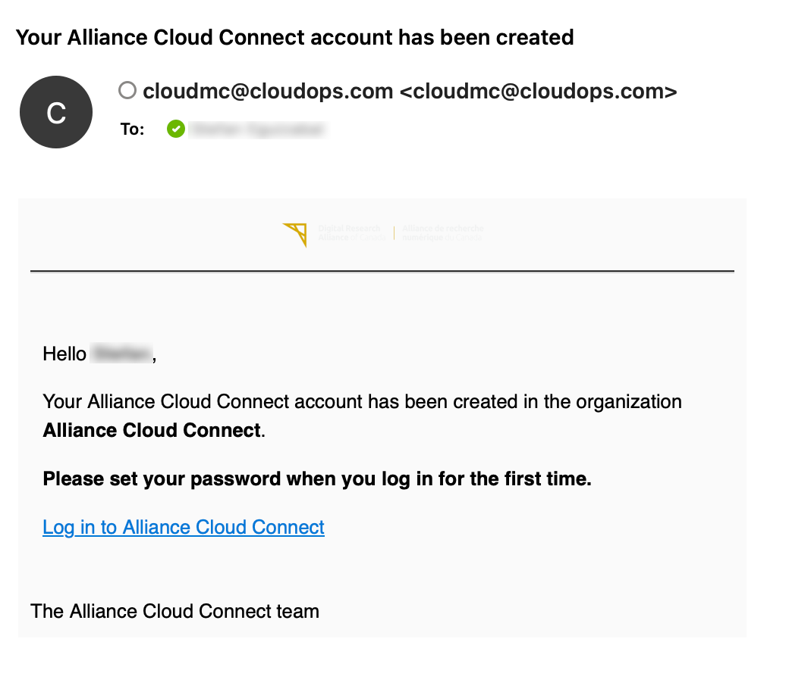
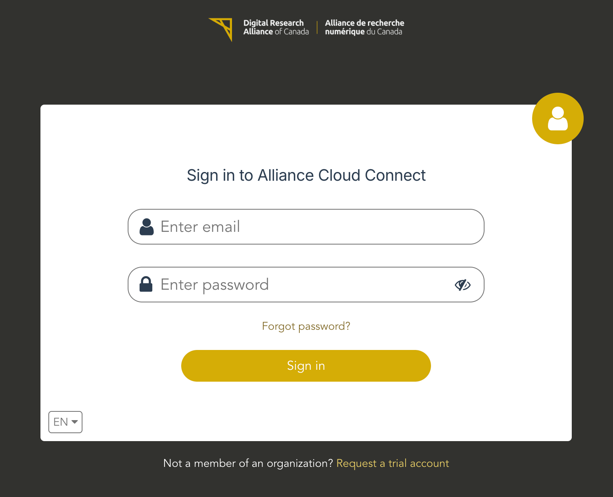
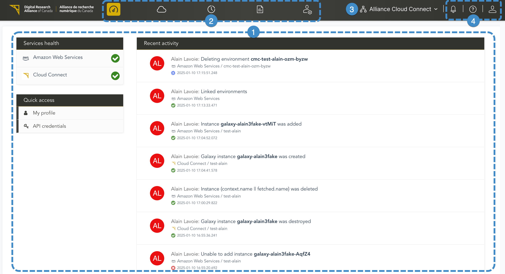
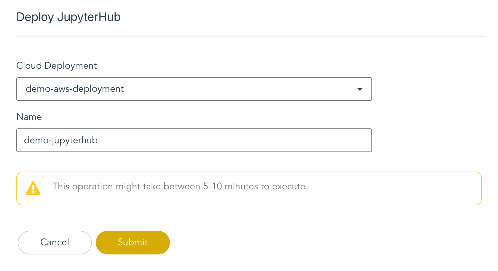
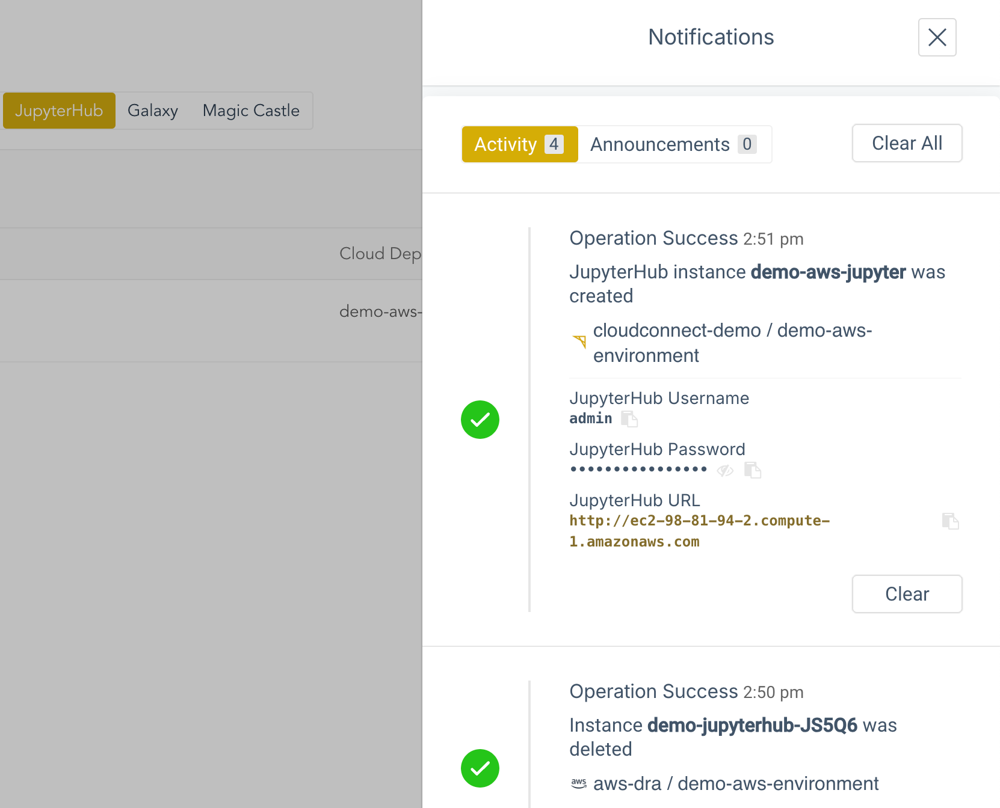
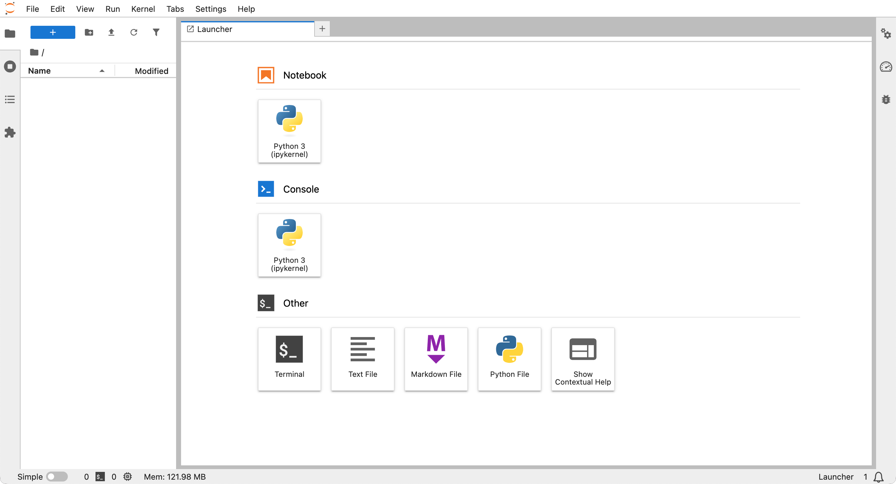
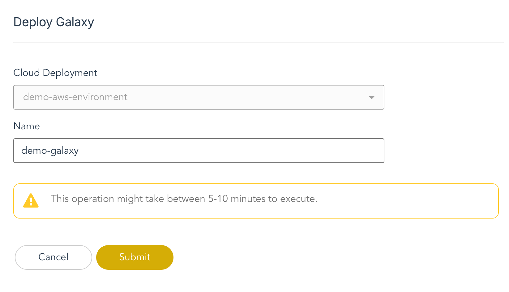
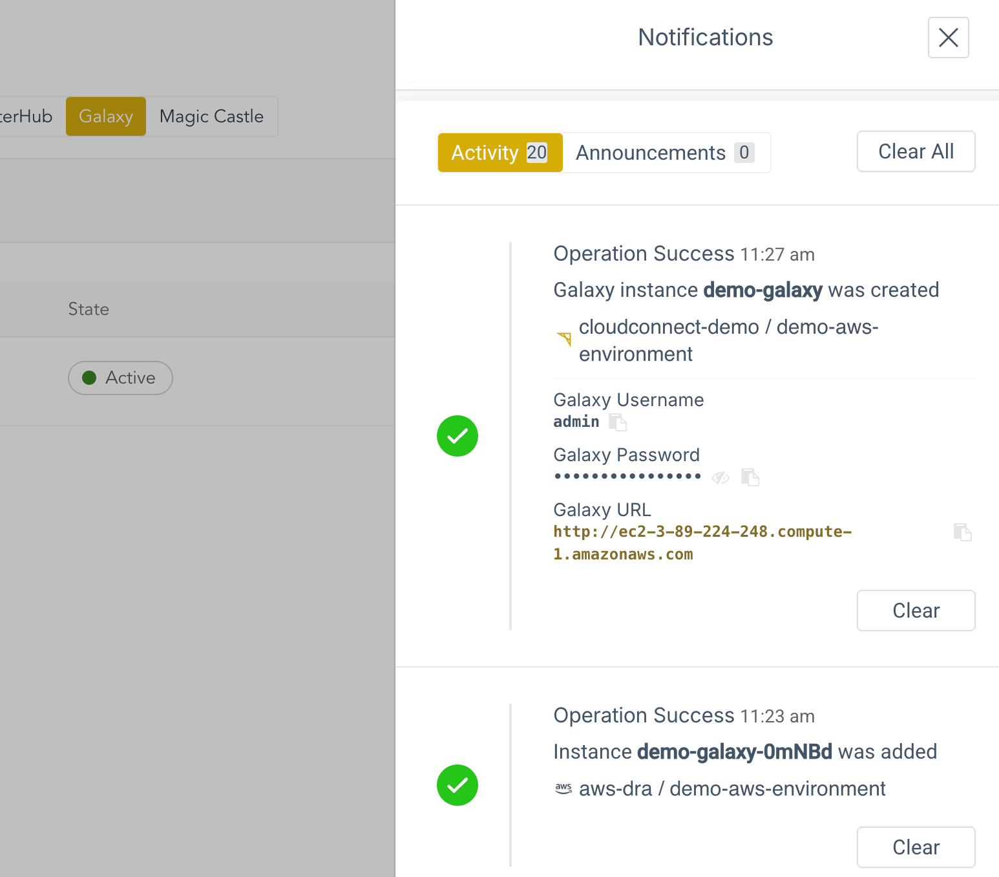
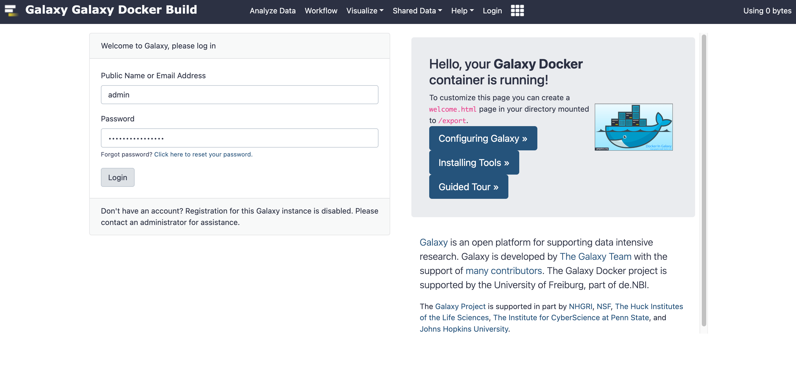
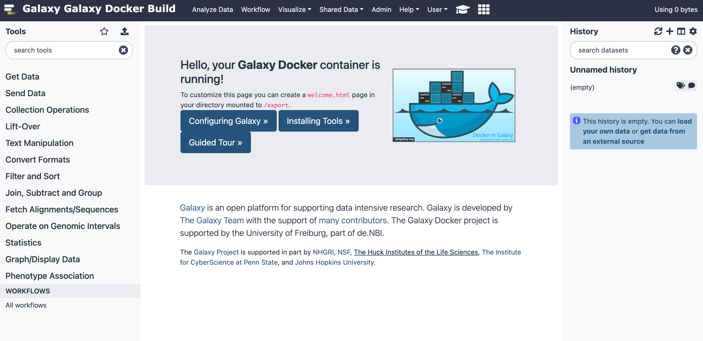

# Overview

Welcome to Alliance Cloud Connect Pilot \(ACCP\). This document will guide you through the process of configuring and connecting to your research apps in a Cloud Connect cloud deployment.

## Summary

The ACCP platform enables you to use Cloud Connect to configure and deploy specific research apps such as JupyterHub, Galaxy, and Magic Castle. In the ACCP interface, you can access the resources deployed in the public clouds, alongside Cloud Connect, which serves as the access point for your research apps.

In this guide, you will find an overview of the basic workflows and concepts in ACCP that you will need to get started, as well as the specific procedures for deploying and connecting to research apps.

## Workflow

The following are the high-level steps required to deploy one or more research apps:

1.  **Select a Cloud Connect deployment**

    The Cloud Connect deployment is where each set of research app deployments can be created, managed, and destroyed. A Cloud Connect deployment has already been created for your use.

2.  **Deploy research app**

    In this step, you will use Cloud Connect to deploy the desired research app in the cloud deployment you selected in the previous step.

3.  **Connect to research app**

    Using the credentials and endpoint that were generated during the deployment, you will now connect to your new research app.

## Basic concepts

-   **Organization**:

    A grouping of related end-users and resources. The services needed to enable Cloud Connect have already been assigned to the organization created for your team.

-   **Environment**:

    A logical unit within an organization that exposes the resources provided by Cloud Connect, and is used to further isolate and group resources securely. Access is controlled via a combination of environment roles and organization access controls.

    An environment has already been provided to you by your principal investigator \(PI\). The environment is named with the Resource Allocation Project Identifier \(RAPI\) associated with your project.

-   **User**:

    A user account is how an individual connects to ACCP.

-   **Member**:

    To access a given environment, a user normally must be made a member of that environment, either manually or automatically. However, some organization-level access controls will grant implied access to environments for certain users even if they aren't members.

## Accessing your environments

To access the platform, follow the procedure in the [Log into ACCP](#drac-onboarding-log-into-cloud-connect) section.

Navigate to **Services** &gt; **Cloud Connect** to see the pre-defined environment that has been created for your team, which might correspond to your RAPI. Within the environment is a Cloud Connect deployment, where you will deploy your research apps.

The user account that was created for you has the been assigned privileges to see all environments in your organization \(this is called the **Admin** system role\). Therefore, there is no need to add yourself as a member to the pre-defined environment.

You may also create new environments as needed. For details on this, as well as on how to access and manage the individual instances, storage, and other resources used by the research app deployments, see the ACCP Administration Guide.

## Troubleshooting

If any errors arise, ACCP includes tools that are helpful for troubleshooting:

-   **Activity log**

    To see a list of events that have been logged by the platform, click on the **Activity** button in the toolbar at the top of the ACCP interface. Each event includes a description and basic identifying properties. If more details are available, they may be viewed by clicking on the link labeled **Details** in the event. If there are any sub-events, click on the disclosure triangle to the left of the event details to see the child events.

-   **Terraform log**

    When deploying a research app, the output of the Terraform process can be accessed by navigating to your cloud deployment, clicking on the desired app, and viewing its details page.

# Log into ACCP

The ACCP platform is available at the following URL: [https://allianceaccp.cloudmc.ca/](https://allianceaccp.cloudmc.ca/)

In order to log into the system for the first time, will need to open the invitation email that was sent to you. Click on the link to set the password for your ACCP account.

The password requirements will be listed on this page. You will be asked to enter the password twice. If the invitation link has expired, please ask to have the invitation resent to you. Once the password has been saved, you will be redirected to the login page. You are ready to log into the system.

Upon logging in, you are presented with the **Home** page for the system.

1.  **Workspace**

    The workspace is the main section of all ACCP screens. The items that are visible in the workspace are determined by the context of where you are in the system.

2.  **Main navigation buttons**

    The row of buttons at the top centre of the screen is where you can navigate to all of the major features of the system, including the home page, **Services**, **Reporting**, the **Activity log**, and **Administration**.

3.  **Organization picker**

    ACCP is a multi-tenant platform. Use the organization picker to navigate between the organizations and sub-organizations you have access to.

4.  **Additional tools**
5.  This section contains three items: the help menu, the notifications menu, and the user menu.

# Deploy and Connect to JupyterHub

## Deploy JupyterHub

### Before you begin

-   You must already have a Cloud Connect deployment

### Procedure

1.  Navigate to **Services** &gt; **Cloud Connect** and click on your deployment from the list of cloud deployments.

2.  Click on the **JupyterHub** tab.

    It is also possible to click on your target cloud deployment, then from the sidebar on the left, click on **JupyterHub**. When deploying via this route, the cloud deployment will be pre-selected and not modifiable when deploying JupyterHub.

3.  Click on the **Deploy JupyterHub** button.

    The **Deploy JupyterHub** page appears.

4.  Enter a name for the deployment.

5.  From the **Cloud Deployment** popup menu, select the target cloud deployment.

6.  Click the **Submit** button.

    

7.  The **JupyterHub** tab reappears. The new JupyterHub deployment is being provisioned and will take several minutes.

8.  Once the deployment is complete, the **Notifications** panel will appear with the credentials and endpoint needed to connect to JupyterHub.

    Make a note of this information and store it securely. Once the notification disappears from the panel, it cannot be recovered.

    

### Results

-   Your JupyterHub app has been installed in the selected cloud deployment
-   You have securely stored the credentials and endpoint for the JupyterHub deployment

## Connect to JupyterHub

### Before you begin

-   You must have a [JupyterHub deployment](#drac-onboarding-deploy-jupyterhub) available
-   You must have the endpoint and credentials for the target JupyterHub deployment

### Procedure

1.  Navigate to the URL of the endpoint.

2.  With your credentials, log into JupyterHub.

    

3.  After the JupyterHub instance launches, you will be presented with the JupyterHub interface.

    

# Deploy and Connect to Galaxy

## Deploy Galaxy

### Before you begin

-   You must already have a Cloud Connect deployment

### Procedure

1.  Navigate to **Services** &gt; **Cloud Connect** and click on your deployment from the list of cloud deployments.

2.  Click on the **Galaxy** tab.

    It is also possible to click on your target cloud deployment, then from the sidebar on the left, click on **Galaxy**. When deploying via this route, the cloud deployment will be pre-selected and not modifiable when deploying Galaxy.

3.  Click on the **Deploy Galaxy** button.

    The **Deploy Galaxy** page appears.

4.  Enter a name for the deployment.

5.  From the **Cloud Deployment** popup menu, select the target cloud deployment.

6.  Click the **Submit** button.

    

7.  The **Galaxy** tab reappears. The new Galaxy deployment is being provisioned and will take several minutes.

8.  Once the deployment is complete, the **Notifications** panel will appear with the credentials and endpoint needed to connect to Galaxy.

    Make a note of this information and store it securely. Once the notification disappears from the panel, it cannot be recovered.

    

### Results

-   Your Galaxy app has been installed in the selected cloud deployment
-   You have securely stored the credentials and endpoint for the Galaxy deployment

## Connect to Galaxy

### Before you begin

-   You must have a [Galaxy deployment](#drac-onboarding-deploy-galaxy) available
-   You must have the endpoint and credentials for the target Galaxy deployment

### Procedure

1.  Navigate to the URL of the endpoint.

2.  With your credentials, log into Galaxy.

    

3.  After the Galaxy instance launches, you will be presented with the Galaxy interface.

    

# Feature Status

This section provides a summary of the development status of various features in the ACCP platform.

Last updated: 23 January 2025

|Feature|Status|Description|
|-------|------|-----------|
|Cloud Connect Cloud Deployment creation|Complete|Available for AWS and GCP. Azure and Arbutus are under development.|
|CILogon integration|Available with next update|Allows for logging into the AWS console from ACCP using single sign on.|
|JupyterHub basic deployment|Complete|Installs JupyterHub on AWS infrastructure.|
|JupyterHub user creation|In review|Allows user to specify a username and a password to be created in JupyterHub at deployment time.|
|JupyerHub instance and storage type|In review|Allows user to specify a machine type for their instances and storage type for their volumes.|
|Galaxy basic deployment|Complete|Installs Galaxy on AWS infrastructure.|
|Galaxy user creation|In review|Allows user to specify a username and a password to be created in Galaxy at deployment time.|
|Galaxy instance and storage type|Under development|Allows user to specify a machine type for their instances and storage type for their volumes.|
|Galaxy instance power management|In review|Allows a Galaxy instance to be stopped, started, and destroyed from within Cloud Connect.|
|Magic Castle basic deployment|Complete|Installs Magic Castle on AWS and Azure infrastructure.|
|Magic Castle simplified deployment form|Under development|The simpler form will ask only for machine type and number of compute nodes.|
|Cost reporting|Complete|Available for AWS and Azure deployments.|

Explanations of status:

-   **Under development**

    Feature is currently being worked on by the CloudOps development team.

-   **In review**

    Feature has been implemented and is currently under review for quality and completeness.

-   **Available with next update**

    Feature has been finalized and will be deployed with the next regularly scheduled software update.

-   **Complete**

    Feature is fully functional on the ACCP platform.