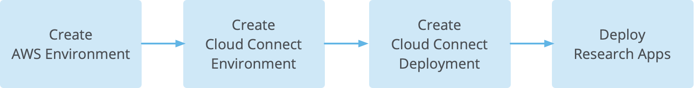
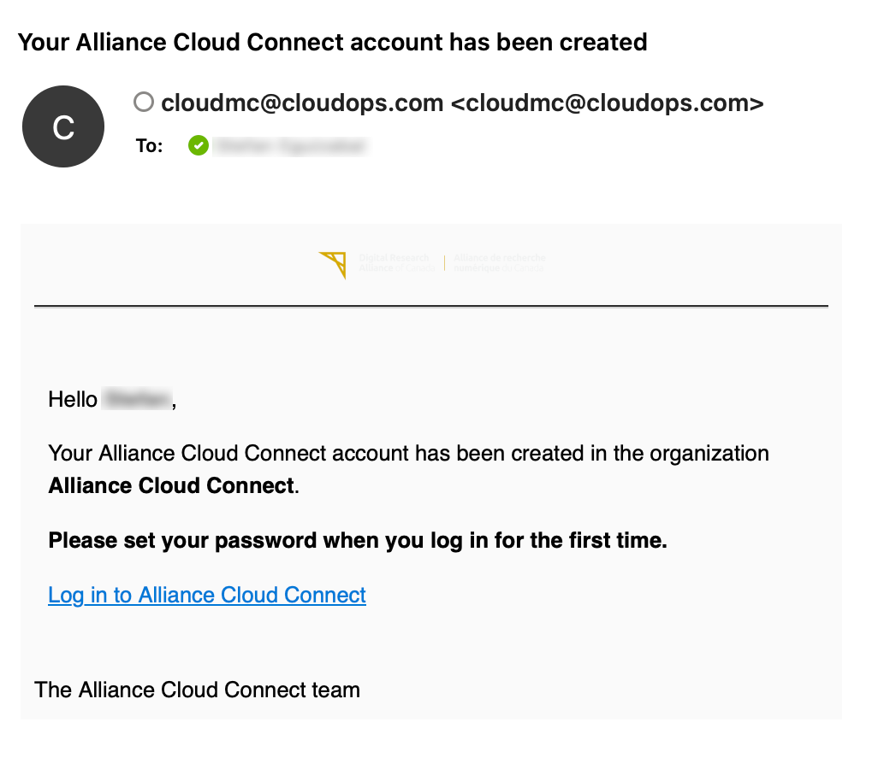
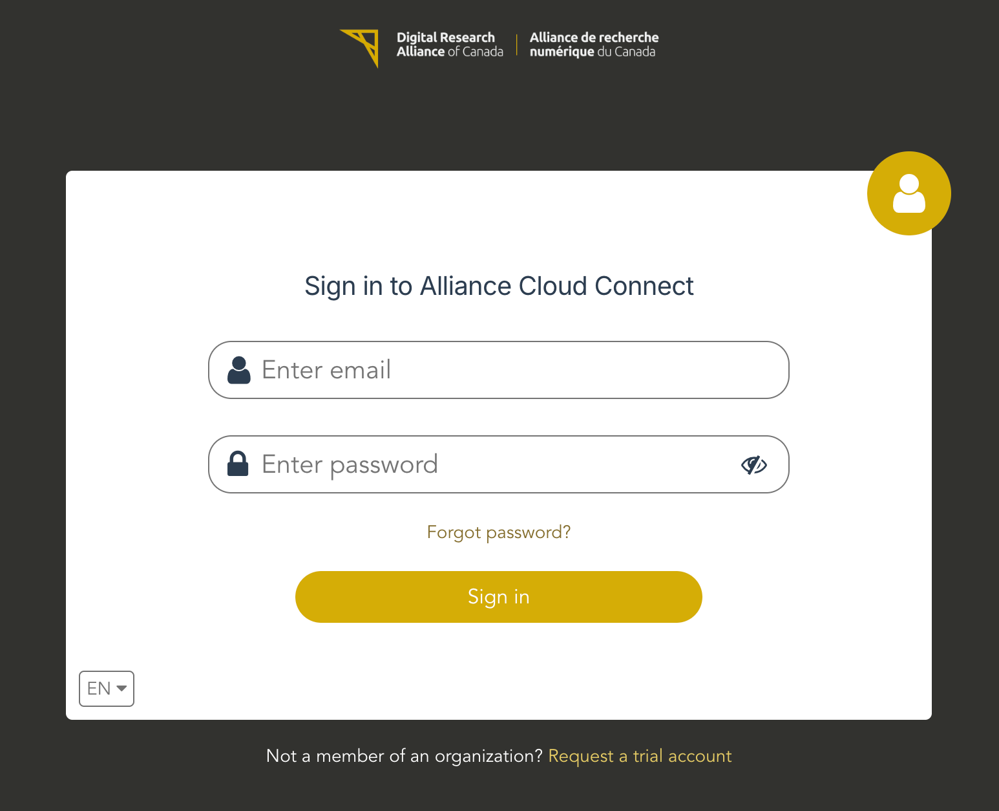
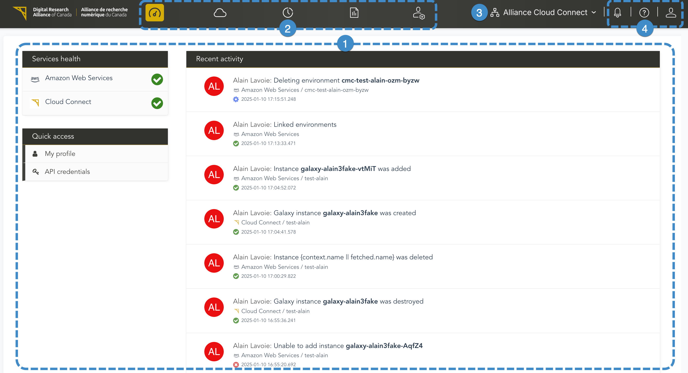
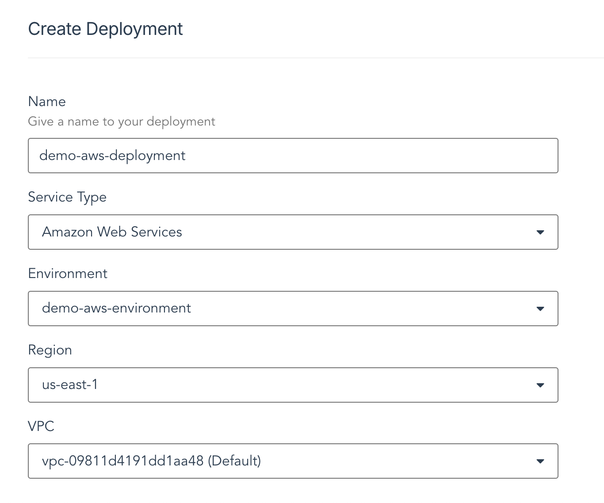

# Overview

Welcome to Alliance Cloud Connect Pilot \(ACCP\). This guide is intended for administrative users of the ACCP platform who will need to prepare environments for research users who will be deploying applications.

## Summary

The ACCP platform enables researchers to access cloud services like Amazon Web Services \(AWS\) and Microsoft Azure through Cloud Connect, where they can configure and deploy specific research apps such as JupyterHub, Galaxy, and Magic Castle. In the ACCP interface, you can access the resources deployed in the public clouds, alongside Cloud Connect, which serves as the access point for the research apps.

In this guide, you will find an overview of the basic workflows and concepts in ACCP that you will need to get started. Additionally, specific procedures are provided for configuring and deploying the resources that are necessary for getting the research apps ready for operation. At this time, we will focus only on deploying to AWS.

## Workflow

The following are the high-level steps required to deploy one or more research apps:

1.  **Create an AWS environment**

    The instances, storage, and networking resources for each research app will eventually be deployed in the environment you create.

2.  **Create a Cloud Connect environment**

    This environment will contain each cloud deployment.

3.  **Create a Cloud Connect deployment**

    This is where each set of research app deployments can be created, managed, and destroyed.

4.  **Deploy research apps**

    In this step, you will use Cloud Connect to deploy the desired research app in the cloud deployment you created in the previous step.

**Tip:** This guide focuses on steps 1 through 3. For information on step 4, depolying research apps, please see the ACCP User Guide.

## Basic concepts

-   **Organization**:

    A grouping of related end-users and resources. The services needed to enable Cloud Connect have already been assigned to your organization.

-   **Service**:

    A remote entity, such as AWS, Azure, or Cloud Connect, that is made available to users via the ACCP user interface. Users interact with services via environments that are created within each service.

    In ACCP, you will see multiple services. Cloud Connect resources will be deployed in the AWS or Azure services. You can manage these backend resources through the appropriate service in ACCP.

-   **Environment**:

    A logical unit within an organization that exposes the resources of a service, and is used to further isolate and group resources securely. Access is controlled via a combination of environment roles and organization access controls.

-   **User**:

    A user account is how an individual connects to ACCP.

-   **Member**:

    To access a given environment, a user normally must be made a member of that environment, either manually or automatically. However, some organization-level access controls will grant implied access to environments for certain users even if they aren't members.

## Troubleshooting

If any errors arise, ACCP includes tools that are helpful for troubleshooting:

-   **Activity log**

    To see a list of events that have been logged by the platform, click on the **Activity** button in the toolbar at the top of the ACCP interface. Each event includes a description and basic identifying properties. If more details are available, they may be viewed by clicking on the link labeled **Details** in the event. If there are any sub-events, click on the disclosure triangle to the left of the event details to see the child events.

-   **Terraform log**

    When deploying a research app, the output of the Terraform process can be accessed by navigating to your cloud deployment, clicking on the desired app, and viewing its details page.

# Log into ACCP

The ACCP platform is available at the following URL: [https://allianceaccp.cloudmc.ca/](https://allianceaccp.cloudmc.ca/)

In order to log into the system for the first time, will need to open the invitation email that was sent to you. Click on the link to set the password for your ACCP account.

The password requirements will be listed on this page. You will be asked to enter the password twice. If the invitation link has expired, please ask to have the invitation resent to you. Once the password has been saved, you will be redirected to the login page. You are ready to log into the system.

Upon logging in, you are presented with the **Home** page for the system.

1.  **Workspace**

    The workspace is the main section of all ACCP screens. The items that are visible in the workspace are determined by the context of where you are in the system.

2.  **Main navigation buttons**

    The row of buttons at the top centre of the screen is where you can navigate to all of the major features of the system, including the home page, **Services**, **Reporting**, the **Activity log**, and **Administration**.

3.  **Organization picker**

    ACCP is a multi-tenant platform. Use the organization picker to navigate between the organizations and sub-organizations you have access to.

4.  **Additional tools**
5.  This section contains three items: the help menu, the notifications menu, and the user menu.

# Create AWS Environment

## Before you begin

-   You must be logged into the ACCP platform

## Procedure

1.  Navigate to **Services** &gt; **Amazon Web Services**, and click on the **Add Environment** button.

2.  Enter a name and an optional description for the environment.

3.  If you wish to allow users from other organizations to be added as members, select **Allow external members**.

4.  Leave **Restricted environment** unchecked, and click the **Next** button.

    The AWS environment will now be provisioned. Once the environment has been provisioned, the **Manage Members** page appears.

5.  On the **Manage Members** page, you may:

    -   Select one or more individual users from the list
    -   Search for specific users
    -   Add all users in the organization with the **All users** \(auto-membership\) option
    -   Add no users to your environment \(click **Skip** to proceed to the next page\)
6.  For any users you've added, select an environment role, and if you've enabled auto-membership, select a default environment role.

    -   **Viewer**: Read-only access to the environment
    -   **Editor**: Can read, write, and provision resources in the environment, but cannot change the environment settings nor manage users
    -   **Owner**: Adds the ability to change the environment settings and to manage users
7.  Click **Apply** to commit the selected members. The users will be added.

    The list of environments now appears.

## Results

-   The AWS environment has now been created, and appears on the list of environments
-   The environment was automatically created with a default VPC, and one subnet
-   You are now ready to configure [Cloud Connect](#configure-and-deploy-cloud-connect)

# Configure and Deploy Cloud Connect

## Create Cloud Connect Environment

### Before you begin

-   You must have a new AWS environment already created
-   The AWS environment must have the default VPC with at least one subnet

    **Attention:** At this time, only a new AWS environment is supported by Cloud Connect.

### Procedure

1.  Navigate to **Services** &gt; **Cloud Connect**, and click on the **Add Environment** button.

2.  Enter a name and an optional description for the environment.

3.  If you wish to allow users from other organizations to be added as members, select **Allow external members**.

4.  Leave **Restricted environment** unchecked, and click the **Next** button.

    The Cloud Connect environment will now be provisioned. Once the environment has been provisioned, the **Manage Members** page appears.

5.  On the **Manage Members** page, you may:

    -   Select one or more individual users from the list
    -   Search for specific users
    -   Add all users in the organization with the **All users** \(auto-membership\) option
    -   Add no users to your environment \(click **Skip** to proceed to the next page\)
6.  For any users you've added, select an environment role, and if you've enabled auto-membership, select a default environment role.

    -   **Viewer**: Read-only access to the environment
    -   **Editor**: Can read, write, and provision resources in the environment, but cannot change the environment settings nor manage users
    -   **Owner**: Adds the ability to change the environment settings and to manage users
7.  Click **Apply** to commit the selected members. The users will be added.

    The list of environments now appears.

### Results

-   The Cloud Connect environment has now been created, and appears on the list of environments
-   You are now ready to [create a Cloud Connect deployment](#create-cloud-connect-deployment)

## Create Cloud Connect Deployment

### About this task

### Before you begin

-   You must have already created a Cloud Connect environment

### Procedure

1.  Navigate to **Services** &gt; **Cloud Connect**, and when the list of environments appears, click on the Cloud Connect environment you created in the previous section.

2.  When the **Cloud Deployments** page appears, click on the **Create Deployment** button.

    The **Create Deployment** page appears.

3.  Enter a name for your deployment.

4.  Select **Amazon Web Services** from the **Service Type** popup menu.

5.  Click on the **Environment** popup menu and select the AWS environment you created in the [Create AWS Environment](#create-aws-environment) section.

6.  Select the AWS region in which to create this deployment.

7.  Select the desired VPC where the instances for this deployment will be launched.

8.  Click **Submit**.

    

### Results

-   Your deployment now appears on the **Cloud Deployments** page
-   You may now configure your research apps

